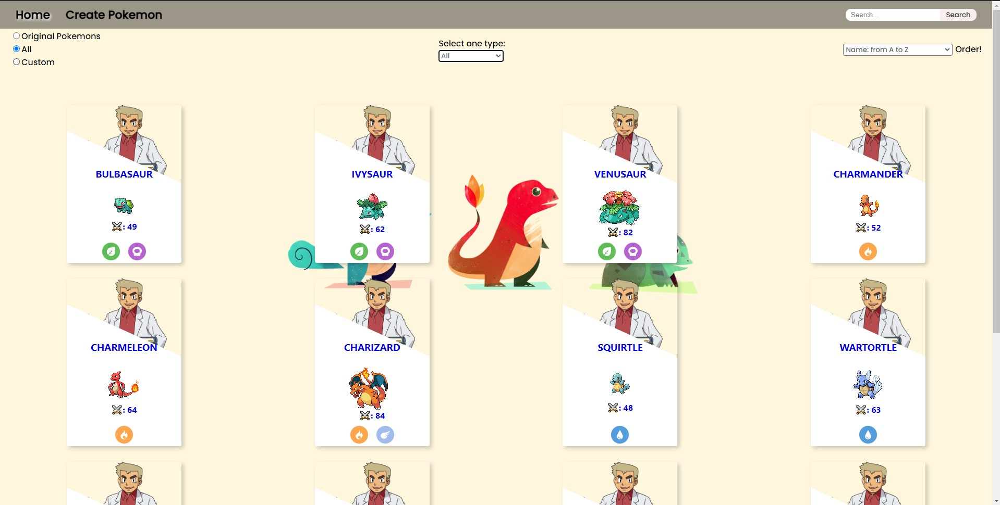
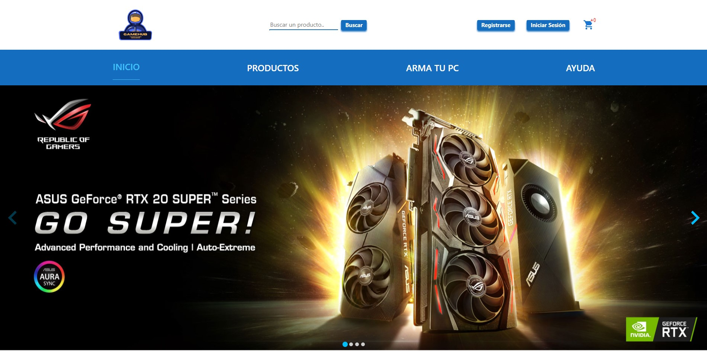

<h1 align="center">Hi 👋, I'm Juan Gomez Borghini</h1>

<h3 align="center">A passionate Front-end Developer from Argentina 🌟.</h3>

<b> I am a 32-year-old Argentinian who loves video games and technology. I am currently focused on front-end web development and learning new technologies to make the most of them. I rediscovered my passion for programming and obtained a full-stack web developer certification.</b>

<h3>Projects</h3>
<b><a href="https://pokemon-pi-six.vercel.app/" target="_blank">Poke App</a></b>

Poke App is a SPA (single page application) where we apply the knowledge learned in the SoyHenry bootcamp! Using technologies such as: React, Redux, NodeJS, Express, CSS, HTML, Sequelize and PostgreSQL.

<b><a href="https://gamehub-chi.vercel.app/" target="_blank">Game HUB</a></b>

 GameHUB is an e-commerce platform designed for the purchase and sale of computer products. The website has different roles for navigation: "User" for purchasing products, "Admin" for managing sales, inventory, and users, and "Owner" for managing the website as the owner. We used technologies such as React, Redux, TypeScript, Material-UI, and pure CSS for the front-end, Node.js, Express, Mongoose, Nodemailer, Stripe, Mercadopago, Cloudinary for the back-end, and MongoDB for the database.

<h3 align="left">Languages and Tools:</h3>

 
 
 
 
 
 
 
 
 
 
 
 
 

- 📫 How to reach me <a href="mailto: juangborghini@gmail.com">CLICK HERE!</a>

<h3 align="left">Connect with me:</h3>

